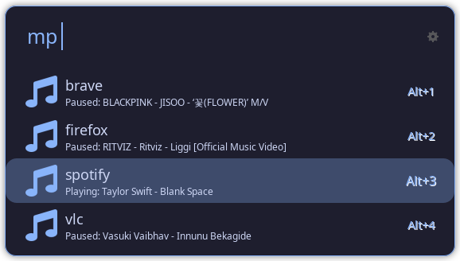
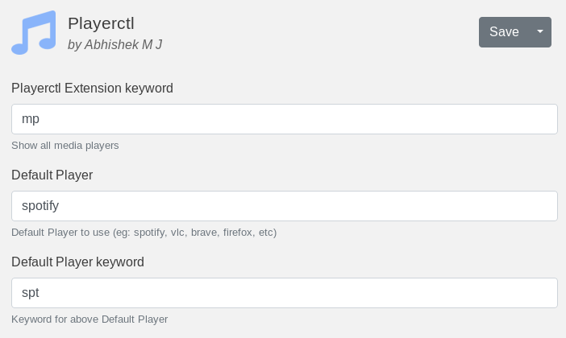
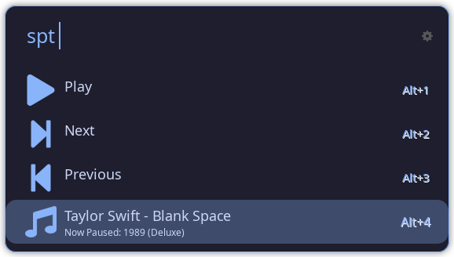

# Playerctl Ulauncher extension



[Ulauncher](https://ulauncher.io/) extension for controlling any media player (Spotify, VLC, Browsers, etc) using [playerctl](https://github.com/altdesktop/playerctl)

## Features

- Info and Status of the song
- Supported controls for the players:
  - [x] play-pause
  - [x] next
  - [x] previous
  - [ ] loop
  - [ ] shuffle
- Set a default player for direct control

<table>
  <tr>
    <td></td>
    <td></td>
  </tr>
</table>

## Installation

- Install [playerctl](https://github.com/altdesktop/playerctl) for your distro.
- Then open Ulauncher preferences window > extensions > add extension and paste the following url:

```
https://github.com/abhishekmj303/ulauncher-playerctl
```

PS: If you are thinking which theme I am using, it's [Catppuccin](https://github.com/catppuccin/ulauncher)
